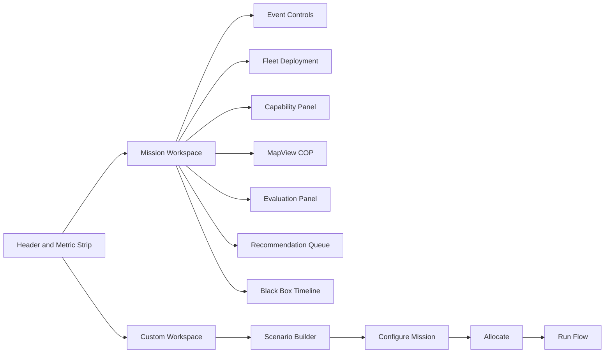

# d4d-mission-metabolism 심층 분석 보고서

## 요약

이 저장소는 **D4D 해커톤의 Multi-UxV Control 문제를 “기체 조종 UI”가 아니라 “capability-centric mission OS”로 풀겠다**는 문제정의와 상당히 잘 맞는다. `AGENTS.md`는 이 프로젝트를 “한 사람이 여러 기체를 직접 조종하는 문제”가 아니라 **손실·교란·재구성이 반복되는 다중 UxV 전력을 1명의 운용자가 임무 능력 단위로 유지하는 문제**로 다시 정의하고 있고, `deep-research-report.md` 역시 **Capability Fabric, MCC, Mission Metabolism, Autonomy Debt, Tactical Immune System, Recommendation Card + Approval Gate, CCR, Mission Black Box**를 핵심 축으로 제시한다. 제가 이 두 문서를 먼저 검토했고, 아래 평가는 그 문서들을 기준선으로 삼아 작성했다. citeturn39view3turn33view2turn33view3turn33view4turn33view6

코드 구현은 그 방향을 **꽤 많이** 반영한다. 백엔드는 `Vehicle`을 capability vector와 health 상태로 모델링하고, `compute_capability_report`로 MCC와 area별 coverage/deficit을 계산하며, `evaluate_metrics`로 strain·collapse probability·autonomy debt·CCR을 산출한다. 또한 `response_planner.py`, `immune_cards.py`, `immune_actions.py`, `immune.py`가 합쳐져 이벤트 기반 복구안 생성, 승인/거절/수동개입, micro-action 적용까지 닫힌 루프를 만든다. 프런트엔드는 `MetricStrip`, `CapabilityPanel`, `RecommendationPanel`, `BlackBoxPanel`, `EvaluationPanel`, `MapView`를 중심으로 이 상태를 시각화하고, `ScenarioBuilderPanel`로 커스텀 시나리오까지 편집할 수 있다. citeturn19view1turn21view1turn29view0turn31view0turn10view0turn26view0turn28view0turn28view5turn13view0turn28view3turn28view6

하지만 **가장 중요한 정합성 기준**, 즉 사용자의 prior report인 **「D4D 해커톤용 Capability-centric Mission Metabolism MVP 구현 계획서」와의 alignment** 관점에서는 아직 발표 전 반드시 손봐야 할 구멍이 있다. 가장 큰 것은 **Mission Intent Card 계층의 불완전성**이다. AGENTS 문서는 objective, areas, constraints, autonomy level, human approval policy를 입력하는 계층을 요구하지만, 현재 `MissionConfigureRequest`는 `objective`, `mission_type`, `areas`만 받고, 서버는 커스텀 미션 생성 시 `constraints=MissionConstraints()`를 하드코딩한다. 즉 **제약, 자동화 레벨, human approval policy가 입력도 안 되고 저장도 안 된다**. 이것은 정렬도 측면에서 가장 큰 미구현이다. citeturn39view3turn43view0turn43view1

두 번째 치명점은 **A/B 지표 무결성**이다. `EvaluationPanel`은 재계획 시간 baseline을 `"46s"`, 붕괴 위험 baseline을 `"64%"`로 하드코딩하고, 위험 감소도 `0.64 - 현재 collapse_probability`로 계산한다. 이는 prior report와 AGENTS가 요구한 **paired A/B evaluation**과 다르다. 더 나쁜 점은 `apply_event_to_snapshot`이 이벤트가 들어오기만 해도 `assisted_operator_actions`를 1 증가시키고, 이후 승인/거절 시에도 `operator_delta=1`이 추가되어 **운용자 조작 수가 이중 집계될 가능성**이 매우 높다는 것이다. 현재 데모의 CCR/A-B 숫자는 이야기거리는 되지만, 심사위원이 “이 숫자, 실제 실험 데이터냐?”라고 물으면 방어가 약하다. citeturn33view7turn44view0turn22view7turn19view7

셋째, **실시간성 설계가 코드에만 있고 UX에는 연결되지 않는다**. 백엔드에는 `/ws/state` 웹소켓이 있고 프런트 store에도 `connectLive()`가 있지만, `App.tsx`는 마운트 시 `hydrate()`만 호출하고 `connectLive()`는 사용하지 않는다. 즉 실시간 상태 스트리밍 설계가 데모 UX로 살아 있지 않다. 또 CORS 화이트리스트가 localhost/127.0.0.1에만 묶여 있어, 발표 환경이 별도 호스트나 LAN IP면 바로 막힐 수 있다. citeturn43view3turn12view0turn10view0turn43view0

결론은 분명하다. **이 프로젝트는 방향이 맞다.** 더 정확히 말하면, **problem framing과 novelty framing은 강하고, core logic도 상당 부분 구현되어 있다.** 그러나 발표 전에는 **Mission Intent layer 보강**, **A/B 수치 무결성 수정**, **웹소켓/배포 설정 정리**, **데모 흐름 고정**이 우선이다. 이 네 가지만 정리하면 “그냥 드론 대시보드”가 아니라 **capability-centric mission metabolism MVP**로 훨씬 설득력 있게 보인다. citeturn39view3turn33view2turn33view6turn43view2turn44view0turn43view3

## 검토 범위와 전제

검토 우선순위는 사용자가 지정한 대로 **리포지토리 1차 자료 우선**으로 두었다. 실제로 먼저 확인한 문서는 `AGENTS.md`와 `deep-research-report.md`였고, 그 후 `backend/`, `frontend/`, `tests/`를 추적했다. `AGENTS.md`는 이 저장소의 기준 문서가 `deep-research-report.md`라고 명시하고, 제품 방향을 Capability-centric Mission Metabolism for Multi-UxV로 고정한다. `deep-research-report.md`는 해커톤용 MVP를 위해 2D mixed-fidelity simulator, Capability Fabric, Mission Metabolism, Recommendation Card, Approval Gate, CCR, A/B dashboard를 순차 구현 우선순위로 제시한다. citeturn39view3turn33view1turn33view6turn33view7

이 보고서의 해석 전제는 다음과 같다. **배포 환경은 “no specific constraint”**, **대상 UxV 조합도 “no specific constraint”**로 두었다. 다만 코드상으로는 air/ground 혼합 자산과 synthetic wingman을 기본값으로 사용한다. `catalog.py`에는 fixed-wing survey UAV, relay UAV, overwatch UAV, GPS-denied UAV, scout rover, sensor rover 등 다종 vehicle profile이 있고, `scenario_seed.py`는 여기에 `SW-01`~`SW-12` synthetic wingman을 추가해 기본 fleet을 구성한다. 따라서 현재 구현은 **특정 플랫폼 통합**보다 **mission-level orchestration demo**를 우선하는 구조로 보는 것이 맞다. citeturn37view0turn37view1turn38view1turn38view2

또 하나의 중요한 해석 전제는, 이 저장소에는 **LLM agent가 아니라 deterministic subsystem**이 있다는 점이다. AGENTS 문서가 말하는 “agent”에 가장 가까운 구현체는 다음 네 가지다. 첫째, allocation planner. 둘째, metabolism evaluator. 셋째, tactical immune response planner. 넷째, human approval gate와 black box recorder다. 즉 “AI agent”라기보다 **capability-aware orchestration pipeline**이라고 보는 것이 정확하다. citeturn39view3turn19view3turn21view1turn29view0turn31view0turn16view1

아래 시스템 그림은 현재 저장소 구현을 기준으로 재구성한 것이다. 설명 텍스트는 실제 파일에 근거하고, 다이어그램은 이를 종합해 표현했다. citeturn43view2turn16view1turn19view1turn21view1turn29view0turn31view0

```mermaid
flowchart LR
    FE[Frontend React UI] --> API[FastAPI main.py]
    API --> RT[MissionRuntime state.py]
    RT --> SCN[scenario.py scenario_events.py scenario_seed.py]
    RT --> CAP[capability.py capability_gap.py]
    RT --> ALLOC[allocator.py]
    RT --> META[metabolism.py]
    RT --> RESP[response_planner.py immune_cards.py immune.py immune_actions.py]
    RT --> BB[blackbox.py]
    API --> WS[/ws/state]
```

## D4D 문제 적합성 평가

이 저장소는 D4D의 **Multi-UxV Control** 문제에 대해, 전형적인 vehicle-centric GCS보다 더 적합한 방향을 이미 취하고 있다. AGENTS 문서는 문제를 “한 사람이 여러 기체를 직접 조종”하는 것이 아니라 **capability budget을 유지하는 supervisory control**로 재정의하고, mixed-fidelity simulator와 synthetic wingman을 P0 우선순위로 둔다. 현재 코드도 실제로 기본 미션 objective를 “모든 UxV를 GCS에 집결시키고, 최적화된 A/B/C ISR task force를 승인하고, reserve rotation을 유지한다”는 표현으로 잡고 있으며, 기본 fleet은 실제 자산 6대와 synthetic wingman 12개를 함께 사용한다. 이것은 해커톤 심사에서 “많은 기체를 한 명이 어떻게 감당하는가”를 설명하기에 매우 유리하다. citeturn39view3turn38view1turn36view3

또한 이벤트 모델도 문제 적합성이 높다. 프런트 `EventControls`와 백엔드 `EventType`/`scenario_events.py`는 `comm_jam`, `gps_drop`, `battery_drop`, `sensor_fail`, `vehicle_lost`, `alert_flood`, `no_go`, `priority_shift`, `data_stale`, `target_detected`, `mobility_blocked`, `weather_degraded`, `collision_risk`, `sensor_confidence_drop`, `asset_added`, `reserve_depleted`를 지원한다. 이는 AGENTS 문서가 “attrition and EW are default assumptions”라고 한 방향과 거의 일치한다. citeturn12view1turn28view1turn36view5turn36view6turn39view3

이 영역을 사용자가 요청한 항목별로 정리하면 아래와 같다.

| 항목 | 평가 |
|---|---|
| 아키텍처 개요 | `MissionRuntime`이 단일 런타임 상태를 들고, 미션 리셋·fleet 배치·allocation·event inject·decision·replay를 orchestration한다. API에서 들어온 요청은 runtime으로 모이고, runtime은 scenario/capability/metabolism/immune/blackbox 계층을 호출한다. citeturn16view1turn43view2 |
| 핵심 모듈/파일 | `state.py`, `main.py`, `scenario_seed.py`, `catalog.py`, `allocator.py`, `capability.py`, `metabolism.py`, `response_planner.py`, `immune.py`, `immune_actions.py`, `blackbox.py`. citeturn41view0turn16view1turn19view3turn21view1turn29view0turn31view0 |
| 데이터 흐름 | 기본값은 `create_initial_snapshot()`로 seed fleet/mission을 만들고, `plan_allocation()`이 assignment를 만들며, `apply_event_to_snapshot()`가 이벤트와 recommendation을 snapshot에 반영한 뒤, `refresh_snapshot()`이 capability report와 metrics를 갱신한다. citeturn20view4turn19view6turn22view7turn19view3 |
| API | `/mission`, `/mission/configure`, `/fleet/deploy`, `/allocate`, `/event/inject`, `/decision`, `/metrics`, `/replay`, `/vehicle/types`, `/mission/types`, `/capability/gaps`, `/ws/state`가 존재한다. citeturn43view2turn43view3 |
| 에이전트 설계 | allocation planner가 useful task force만 전개하고 surplus는 GCS reserve에 남긴다. response planner는 event-specific action과 adaptive reallocation을 결합한다. immune layer는 human approval 이후 micro-action을 적용한다. citeturn19view3turn22view2turn29view0turn29view3turn31view0 |
| UI 흐름 | Mission workspace는 좌측 이벤트 주입/자산 배치/능력 예산, 중앙 COP와 평가 패널, 우측 recommendation queue와 black box로 구성된다. 이는 “operation surface”로는 강하다. citeturn10view0turn28view0turn28view3turn28view5turn13view0 |
| 테스트 커버리지 | 백엔드는 allocator, API, capability gap, core metric/immune 흐름을 테스트한다. 프런트는 workspace tab, custom scenario 데이터 구조, event controls, fleet deployment, map view, recommendation card를 테스트한다. citeturn23view0turn23view1turn23view2turn23view3turn23view4turn23view5turn23view6turn23view7turn23view8turn23view9turn23view10 |

종합 판단은 이렇다. **해커톤 문제 적합성은 높다.** 특히 “실제 다기종·대량 attritable 자산을 1명의 운용자가 어떻게 supervision하느냐”는 질문에 대해, 이 저장소는 **mixed air/ground vehicle catalog + synthetic wingman + reserve management + event-driven reallocation + approval gate**라는 스토리를 이미 제공한다. 다만 현재 구조는 **mission-level supervisory demo**에는 강하지만, **실제 통신 adapter나 vehicle command loop**는 아직 없다. 따라서 발표에서는 “우리는 조종기체 수를 늘리는 도구가 아니라, mission-level orchestration OS를 만들었다”는 프레이밍을 고수하는 편이 맞다. citeturn39view3turn37view0turn38view1turn29view0turn43view2

## Capability-centric Mission Metabolism 정합성 평가

이 항목은 사용자가 가장 높은 우선순위를 준 부분이다. 결론부터 말하면, **핵심 개념 구현은 상당히 정렬되어 있지만, Mission Intent layer와 A/B evaluation layer가 prior report의 수준에 못 미친다.**

강한 정합성부터 보자. AGENTS 문서와 prior report는 Capability Fabric을 **기체 ID가 아니라 capability vector**로 보는 것으로 정의하고, 최소 capability 축을 `visual_recon`, `relay`, `overwatch`, `gps_denied_nav`, `reserve`로 고정한다. 현재 `backend/models.py`와 `frontend/types.ts`는 정확히 이 축을 사용하고, `capability.py`는 `availability_score()`와 `effective_capability()`로 health 상태를 곱한 effective capability를 계산한다. `compute_capability_report()`는 area별 coverage/deficit과 overall MCC를 계산하고, `CapabilityPanel`은 이를 “능력 예산”으로 시각화한다. 이 부분은 prior report와 거의 모범적으로 맞는다. citeturn39view3turn33view2turn16view0turn12view1turn20view0turn19view1turn28view0

Mission Metabolism 역시 **완전히 다른 철학으로 흘러가지 않았다.** `metabolism.py`의 `evaluate_metrics()`는 capability deficit, EW pressure, comm saturation, operator load, attrition risk, relay redundancy를 합성해 strain과 collapse probability를 계산하고, `_autonomy_debt()`는 pending cards, single-point relay risk, uncertainty, autonomy level, 이벤트 수, deficit, recovery action 등을 합성해 debt를 계산한다. 이건 prior report와 AGENTS가 요구한 “heuristic operational risk” 방향과 맞다. 다만 **짧은 horizon에서의 수요/공급 추세 예측**이라기보다 **현재 snapshot 기반 위험 함수**에 더 가깝다. 즉 이름은 Mission Metabolism이지만, 구현은 아직 **dynamic forecast**라기보다 **state-derived risk gauge**다. 발표에서는 이 점을 솔직하게 “forecasting-lite heuristic metabolism MVP”로 표현하는 편이 안전하다. citeturn39view3turn33view2turn21view1turn22view0turn22view1

Tactical Immune System도 정렬도가 높다. `build_recommendation()`은 우선 `plan_event_response()`를 호출해 adaptive reallocation 기반 카드를 시도하고, 실패하면 event별 카드 빌더로 fallback한다. `response_planner.py`는 reallocation event 집합을 정의하고, event-specific action과 allocation action을 합성한 뒤 KPI delta를 preview로 계산한다. `RecommendationPanel`은 pending queue를 severity 순으로 정렬해 approval/reject/manual을 제시한다. AGENTS가 요구한 “explainable capability recomposition”과 “decision cards”에 매우 가깝다. citeturn39view3turn29view0turn29view4turn28view5turn26view2

반대로 **가장 큰 미정렬**은 Mission Intent Card다. AGENTS는 상단에 objective, areas, constraints, automation level, approval policy를 입력하는 Mission Intent layer를 명시하지만, 현재 프런트엔드에는 별도의 Mission Intent Card가 없다. `Header`는 objective와 기본 제약 요약만 보여주고, `ScenarioBuilderPanel`은 area와 event flow를 편집하지만 autonomy, approval, target_mcc 같은 mission governance 입력을 노출하지 않는다. 서버에서도 `MissionConfigureRequest`는 `objective`, `mission_type`, `areas`만 받으며, `_mission_from_configure_request()`는 `constraints=MissionConstraints()`를 고정으로 꽂는다. 이것은 prior report와의 정합성에서 **가장 큰 P0 결손**이다. citeturn39view3turn26view8turn28view6turn34view2turn34view3turn34view4turn43view0turn43view1

두 번째 미정렬은 A/B 대시보다. prior report와 AGENTS는 **paired baseline vs assisted** 비교를 강조하지만, `EvaluationPanel`의 baseline 중 일부는 실제 run에서 측정된 값이 아니라 `"46s"`, `"64%"` 하드코딩이다. 이건 데모용 밑그림으로는 이해되지만, prior report의 기준으로는 아직 구현 완료라고 부르기 어렵다. citeturn33view7turn39view3turn44view0

아래 표는 **의도 기능 대비 구현 상태**를 alignment 관점에서 정리한 것이다.

| 의도 기능 | prior report 및 AGENTS 기준 | 현재 구현 상태 | 판정 |
|---|---|---|---|
| Capability Fabric | capability vector 기반 표현, state-weighted effective capability 필요. citeturn39view3turn33view2 | `CapabilityVector`, `effective_capability()`, `compute_capability_report()` 구현. 프런트 `CapabilityPanel` 존재. citeturn16view0turn20view0turn19view1turn28view0 | **구현됨** |
| MCC | area/task별 coverage와 overall score 필요. citeturn39view3turn33view3 | area별 coverage/deficit, overall MCC 계산 및 UI 표출. citeturn19view1turn28view0 | **구현됨** |
| Mission Metabolism | collapse probability와 strain을 계산하되, mission survival 관점이어야 함. citeturn39view3turn33view2 | `evaluate_metrics()`가 strain/collapse를 계산하나, snapshot heuristic 성격이 강함. citeturn21view1turn22view0 | **부분 구현** |
| Autonomy Debt | pending cards, uncertainty, single-point risk 등 반영 필요. citeturn39view3 | `_autonomy_debt()`가 이를 반영. citeturn22view0 | **구현됨** |
| Tactical Immune System | 이벤트별 국소 복구 + adaptive reallocation 필요. citeturn39view3turn33view3 | `response_planner.py`, `immune_cards.py`, `immune_actions.py`로 구현. citeturn29view0turn29view3turn31view0 | **구현됨** |
| Recommendation Card + Approval Gate | 원인, 조치, 예상 효과, 승인/거절/수동 필요. citeturn39view3turn33view3 | `RecommendationPanel`과 `/decision` 흐름으로 구현. citeturn28view5turn26view2turn20view5 | **구현됨** |
| Command Compression Ratio | external/internal 둘 다 측정 제안. citeturn39view3turn33view4 | metric 모델에는 `ccr_external`, `ccr_internal` 존재. UI는 `EvaluationPanel`에서 internal만 직접 노출. citeturn12view1turn44view0 | **부분 구현** |
| Mission Black Box | 이벤트·추천·결정·결과 replay 가능해야 함. citeturn39view3 | runtime이 blackbox 기록, 프런트 `BlackBoxPanel` 존재. citeturn16view1turn13view0 | **구현됨** |
| Mission Intent Card | objective, areas, constraints, autonomy, approval policy 입력 필요. citeturn39view3 | objective/areas 일부만 있음. autonomy/approval/constraints 입력·저장 부재. 서버는 constraints default 고정. citeturn26view8turn28view6turn34view2turn34view3turn43view0turn43view1 | **핵심 미구현** |
| A/B Evaluation Dashboard | paired baseline vs assisted 실험 구조 필요. citeturn33view7turn39view3 | baseline 일부가 하드코딩이고 paired experimental run 저장 구조가 없음. citeturn44view0 | **핵심 미구현** |

UI 흐름도 역시 의도와 실제를 비교하면 차이가 선명하다. prior report가 권장한 흐름은 Mission Intent Card를 시작점으로 두고, Capability Fabric, MCC, Mission Metabolism Gauge, Recommendation Cards, Approval, Black Box, A/B dashboard로 이어진다. 실제 앱은 `Header` + `MetricStrip` + workspace tabs 뒤에, mission workspace에서 좌측 Event/Fleet/Capability, 중앙 Map/Evaluation, 우측 Recommendation/Black Box를 배치한다. 흐름의 후반부는 매우 잘 맞지만, **입구가 Mission Intent Card가 아니라 “이미 만들어진 dashboard”**라는 점이 핵심 차이다. citeturn33view0turn33view6turn10view0turn26view8turn26view0turn28view5turn13view0



## 구현 정확성과 코드 품질 평가

이 저장소의 백엔드는 **개념적으로는 깔끔한 편**이다. `main.py`가 API surface를 제공하고, `MissionRuntime`이 모든 변이를 관리하며, domain 계산은 allocator/capability/metabolism/immune/scenario로 분리되어 있다. `models.py`와 `types.py`는 비교적 엄격한 schema를 갖고, 프런트도 `zod` schema로 `DashboardState`와 `ReplayResponse`를 검증한다. React 쪽은 `App.tsx`가 layout을 조합하고, `store.ts`가 hydration, reset, deploy, configure, allocate, inject, decide, scripted demo, custom scenario run을 집중 관리하는 구조다. 이것은 hackathon MVP로는 좋은 선택이다. citeturn43view2turn16view1turn16view0turn18view1turn12view1turn10view0turn12view0

다만 correctness 관점에서 몇 가지는 의도가 맞더라도 현재 수치와 흐름을 왜곡할 수 있다.

가장 큰 문제는 **operator action 카운트의 의미 오염**이다. `apply_event_to_snapshot()`는 이벤트가 inject될 때 `assisted_operator_actions`를 `+1` 한다. 그런데 `decide_recommendation()`에서 approve든 reject든 `DecisionImpact(operator_delta=1, ...)`를 또 적용한다. 즉 **사람이 아직 승인도 안 했는데 이벤트 발생만으로 operator action이 증가하고, 실제 승인 시 또 증가**한다. prior report와 AGENTS는 approval gate를 중요한 human interaction으로 보는데, 현재 구현은 “이벤트 수”와 “사람의 실제 판단 개입 수”를 뒤섞는다. 이 버그는 CCR·A/B 조작 수·데모 메시지 전체를 오염시키므로 **가장 먼저 고쳐야 한다.** citeturn22view7turn19view7turn39view3

두 번째는 **EvaluationPanel의 baseline 하드코딩**이다. baseline operator action은 상태값을 쓰지만, 재계획 시간은 `"46s"`, 붕괴 위험은 `"64%"`, 위험 감소는 `0.64 - current`로 계산한다. 이는 measurement가 아니라 연출값이다. prior report가 요구한 paired A/B 구조와 충돌한다. 발표 직전이라면 완벽한 A/B engine까지는 못 가더라도, 적어도 baseline snapshot 두 개를 저장한 뒤 assisted run과 비교하는 방식으로 바꿔야 한다. 그렇지 않으면 숫자 자체보다 **숫자의 신뢰성**이 먼저 공격받는다. citeturn44view0turn33view7turn39view3

세 번째는 **Mission Intent 입력-계산 연결의 단절**이다. 모델에는 `MissionConstraints`, `autonomy_level`, `human_approval_for_replan`, `target_mcc`가 있지만, 커스텀 미션 API는 이를 입력받지 않고 default constraint를 재주입한다. 즉 모델의 표현력에 비해 UI/API가 under-specified다. 이건 코드가 틀렸다기보다 **구현 의도가 중간까지만 연결된 상태**다. 그러나 사용자의 prior report 기준으로는 이 부분이 가장 중요하므로, “미션 의도 입력이 capability metabolism에 영향을 준다”는 체인을 발표 전에 반드시 보강해야 한다. citeturn16view0turn43view0turn43view1turn39view3

네 번째는 **실시간 상태 수신의 미사용**이다. 백엔드는 `/ws/state`를 매초 송신하고, 프런트 store도 `connectLive()`를 제공하지만, `App.tsx`는 `hydrate()`만 호출한다. 데모에서 이대로도 동작은 하지만, “mission metabolism이 실시간으로 갱신된다”는 메시지에 비해 구현 사용량이 덜하다. 발표 데모에서는 scripted event가 충분할 수 있지만, 제품 관점과 코드 정합성 관점에서는 아쉬운 부분이다. citeturn43view3turn12view0turn10view0

다섯 번째는 **배포 설정 리스크**다. `FastAPI` CORS는 localhost/127.0.0.1의 Vite 기본 포트만 허용한다. 발표 환경이 데모 서버 주소, 사설 IP, 터널 도메인, 정적 호스팅 URL이면 브라우저 호출이 막힌다. 이건 기능 버그가 아니라 **발표 실패 리스크**다. 코드 품질 문제라기보다 운영 품질 문제인데, 해커톤 발표에서는 훨씬 치명적일 수 있다. citeturn43view0

테스트는 **좋은 출발점이지만 coverage narrative가 불균형**하다. 백엔드는 allocator 안정성, capability gap 일관성, collapse/autonomy debt 변화, immune card explainability, API endpoint 기본 흐름을 테스트한다. 프런트는 탭 전환, custom scenario mutation, 이벤트 주입 payload, fleet deployment panel, map SVG 동작, recommendation queue 정렬/행동을 테스트한다. 즉 **핵심 로직의 단위/컴포넌트 테스트는 꽤 있다.** 반면, 전용 테스트 파일 목록상 **websocket 연결, blackbox persistence, CORS/deployment profile, mission configure constraints round-trip, 실제 paired A/B experiment**에 대한 테스트는 보이지 않는다. 발표 전 quick fix 이후 이 영역의 회귀 테스트를 추가하는 것이 좋다. citeturn25view0turn25view1turn25view2turn25view3turn25view4turn24view5turn24view6turn24view7turn24view8turn24view9turn24view10turn23view0turn23view1turn23view2turn23view3turn23view4turn23view5turn23view6turn23view7turn23view8turn23view9turn23view10

## 발표 전 수정 우선순위와 실행안

아래 표는 **발표 전 우선순위 이슈**를 severity, 위치, 영향, 수정 요약, 예상 시간 기준으로 정리한 것이다. 시간은 제가 구현 난이도를 보고 산정한 추정치다.

| 우선순위 | 심각도 | 위치 | 문제 | 수정 요약 | 예상 시간 |
|---|---|---|---|---|---|
| P0 | Critical | `backend/src/d4d_mission/scenario.py`, `backend/src/d4d_mission/immune.py`, `frontend/src/components/EvaluationPanel.tsx` | 이벤트 inject만으로 operator action이 증가하고, 승인/거절 시 또 증가해 CCR/A-B가 왜곡될 가능성이 큼. citeturn22view7turn19view7turn44view0 | `apply_event_to_snapshot()`의 `assisted_operator_actions + 1` 제거. operator count는 `decision`에서만 올리기. UI 지표 재검증. | 1~2시간 |
| P0 | Critical | `backend/src/d4d_mission/main.py`, `frontend/src/components/ScenarioBuilderPanel.tsx`, `frontend/src/api.ts` | Mission Intent layer가 constraints/autonomy/approval policy를 받지 못하고 서버에서 default constraints를 강제함. citeturn43view0turn43view1turn34view2turn34view3 | API 스키마와 builder UI에 `target_mcc`, `return_battery_threshold`, `min_relay_redundancy`, `human_approval_for_replan`, `autonomy_level` 추가. | 3~5시간 |
| P0 | High | `frontend/src/components/EvaluationPanel.tsx` | baseline 46s/64%가 하드코딩이라 A/B 실험 메시지가 취약함. citeturn44view0 | baseline snapshot 저장 후 paired compare로 교체. 최소한 seeded baseline run을 state에 저장. | 2~4시간 |
| P0 | High | `backend/src/d4d_mission/main.py` | CORS가 localhost에 고정돼 배포 데모에서 실패 가능. citeturn43view0 | 환경변수 기반 origin 리스트로 변경. | 30분~1시간 |
| P1 | High | `frontend/src/store.ts`, `frontend/src/App.tsx`, `backend/src/d4d_mission/main.py` | `/ws/state`와 `connectLive()`가 있는데 UI에서 쓰지 않음. citeturn43view3turn12view0turn10view0 | App mount 시 websocket 연결 추가, 폴백 hydrate 유지. | 1~2시간 |
| P1 | High | `frontend/src/components/Header.tsx`, `frontend/src/components/ScenarioBuilderPanel.tsx` | Header는 summary만 있고 Mission Intent Card로 보이기 어려움. citeturn26view8turn28view6turn39view3 | 별도 Mission Intent panel 추가 또는 Header 확장. | 2~4시간 |
| P1 | Medium | `backend/tests`, `frontend/tests` | websocket/mission-config/paired A-B 회귀 테스트 부재. 전용 테스트 파일 목록상 확인되지 않음. citeturn23view0turn23view1turn23view2turn23view3turn23view4turn23view5turn23view6turn23view7turn23view8turn23view9turn23view10 | 최소 4개 회귀 테스트 추가. | 2~3시간 |
| P2 | Medium | `backend/src/d4d_mission/metabolism.py` | metabolism이 horizon forecast보다 snapshot risk gauge에 가까움. citeturn21view1turn22view0turn39view3 | 5~10분 horizon simulated degradation predictor 추가. | 4~8시간 |

### 발표 전 빠른 수정안

가장 먼저 할 일은 **수치 무결성 수정**이다. 구체적으로는 `scenario.py`의 `apply_event_to_snapshot()`에서 이벤트 inject 시점의 `assisted_operator_actions` 증가를 제거해야 한다. 현재 이벤트는 operator가 “결정”하지 않았는데도 조작 수가 늘어난다. 이후 `immune.py`의 `approve/reject/manual` 경로에서만 운영자 개입 수를 올리면, `operator_actions`, `ccr_external`, `ccr_internal`, `EvaluationPanel`의 지표가 훨씬 깨끗해진다. 이 수정은 영향 범위가 비교적 제한적이고, 회귀도 프런트/백 양쪽에서 잡기 쉽다. citeturn22view7turn19view7turn21view1

두 번째는 **Mission Intent API 보강**이다. 가장 현실적인 방법은 `MissionConfigureRequest`에 아래 필드를 추가하는 것이다: `constraints.return_battery_threshold`, `constraints.min_relay_redundancy`, `constraints.human_approval_for_replan`, `constraints.target_mcc`, `autonomy_level`. 그리고 `_mission_from_configure_request()`에서 `MissionConstraints()` default를 제거하고 payload 기반으로 `Mission`을 생성해야 한다. 프런트에서는 `ScenarioBuilderPanel` 또는 별도 `MissionIntentPanel`에 이 필드를 넣고, `api.ts`의 `MissionConfigurePayload`, `store.ts`의 `missionPayloadFromCustomScenario()`를 함께 갱신하면 된다. 이 수정은 alignment 개선 효과가 매우 크고, 발표 메시지도 즉시 좋아진다. 근거가 prior report/AGENTS와 정면으로 연결되기 때문이다. citeturn39view3turn43view0turn43view1turn28view6turn10view1turn12view0

세 번째는 **A/B baseline의 측정화**다. 완전한 실험 엔진이 아니어도 된다. 가장 빠른 방법은 store에 `baselineSnapshot`과 `assistedSnapshot`을 추가하고, “초기 allocation 후 이벤트를 manual-mode baseline 룰로 처리한 값”과 “recommendation/approval로 처리한 값”을 seed 기반으로 한 번씩 저장하는 것이다. `EvaluationPanel`은 그 둘을 비교하도록 고치고, `"46s"`/`"64%"`는 제거하면 된다. 심사위원은 복잡한 실험 프레임워크보다도 **“왜 이 수치를 믿어야 하느냐”**를 본다. 하드코딩 제거만 해도 신뢰도가 크게 오른다. citeturn44view0turn33view7turn39view3

네 번째는 **배포 방어선**이다. `main.py`의 CORS origin을 환경변수 기반으로 바꾸고, `frontend/.env`나 배포 환경변수에서 `VITE_API_BASE_URL`을 주입하는 방식으로 정리해야 한다. 동시에 `App.tsx`에서 `connectLive()`를 선택적으로 붙이면, 발표 때 “실시간 업데이트” 데모를 할 수도 있고, 안 되면 hydrate 폴백으로 안전하게 갈 수도 있다. 발표 실전에서는 이중화가 중요하다. citeturn43view0turn10view1turn12view0turn10view0

### Codex 에이전트용 구체 작업 지시안

아래는 바로 구현 작업으로 넘길 수 있는 형태의 지시안이다.

| 작업 | 파일 | 구체 단계 | 리스크 |
|---|---|---|---|
| operator action 이중 집계 제거 | `backend/src/d4d_mission/scenario.py`, `backend/src/d4d_mission/immune.py`, `frontend/src/components/EvaluationPanel.tsx`, 관련 테스트 | `apply_event_to_snapshot()`의 `assisted_operator_actions` 증가 제거 → approval/reject/manual 테스트 수정 → EvaluationPanel 숫자 재검증 | 낮음 |
| Mission Intent 확장 | `backend/src/d4d_mission/main.py`, `backend/src/d4d_mission/models.py`, `frontend/src/api.ts`, `frontend/src/store.ts`, `frontend/src/components/ScenarioBuilderPanel.tsx` | request schema에 constraints/autonomy 추가 → `_mission_from_configure_request()` 수정 → FE form 추가 → payload serialize → 테스트 추가 | 중간 |
| baseline 측정화 | `frontend/src/store.ts`, `frontend/src/components/EvaluationPanel.tsx`, 필요시 `backend/src/d4d_mission/state.py` | baseline run snapshot 저장 구조 추가 → assisted run과 비교 렌더 → 하드코딩 삭제 | 중간 |
| websocket 연결 활성화 | `frontend/src/App.tsx`, `frontend/src/store.ts` | mount 시 `hydrate()` 후 `connectLive()` 연결, unmount cleanup, 연결 실패 시 조용히 무시 | 낮음 |
| CORS 운영화 | `backend/src/d4d_mission/main.py` | env에서 comma-separated origins 읽기 → default localhost 유지 → README 또는 env example 추가 | 낮음 |
| 회귀 테스트 추가 | `backend/tests/test_api.py`, `backend/tests/test_core.py`, `frontend/tests/*.test.tsx` | mission-config round-trip, action-count integrity, evaluation baseline rendering, websocket hook smoke test 추가 | 낮음~중간 |

### 중기와 장기 개선

중기적으로는 **Mission Metabolism을 진짜 metabolism답게** 만들어야 한다. 현재 구현은 좋은 heuristic이지만, 5~10분 horizon에서 battery drain, relay fragility, event severity propagation을 시뮬레이션해 **time-to-collapse**나 **capability half-life** 같은 개념으로 확장할 수 있다. 이는 prior report의 novelty와도 더 잘 맞는다. citeturn39view3turn21view1turn22view0

또한 **protocol adapter boundary**를 실제 모듈로 분리하면 좋다. AGENTS는 core logic을 MAVLink/PX4/ROS2 raw message에 직접 묶지 말라고 했고, 현재 아키텍처도 그렇게 설계돼 있다. 다음 단계는 `adapters/px4`, `adapters/ros2`, `adapters/mavsdk`처럼 명시적 경계를 만들어, 이 MVP가 “그냥 시뮬레이터”가 아니라 **확장 가능한 mission OS kernel**임을 보여주는 것이다. citeturn39view3turn41view0

장기적으로는 **paired A/B evaluator**, **event family benchmark**, **threat layer visualization**, **path/routing deconfliction**, **explainability trace**가 필요하다. 특히 심사 대응 측면에서는 “우리가 어떤 상황군에서 얼마만큼 operator load를 줄였는가”를 seed/시나리오 family 단위로 반복 재현할 수 있어야 한다. prior report가 Battery stress, EW contested, Attrition, Command overload family를 제안한 이유가 바로 이것이다. citeturn33view1turn33view7

## 데모 스크립트와 체크리스트

발표용 데모는 **코드가 잘하는 것**으로 구성해야 한다. 이 저장소는 “실시간 엄청난 fidelity”보다 **문제정의, capability abstraction, event recovery, human approval, black box, metrics**에서 강하다. 따라서 데모도 그 순서로 가야 한다. AGENTS와 prior report가 제안한 흐름은 Mission Intent → Capability Fabric → MCC → Metabolism → Recommendation → Approval → Black Box → A/B Evaluation이다. 현재 UI는 Header/MetricStrip, COP, CapabilityPanel, RecommendationPanel, BlackBoxPanel, EvaluationPanel, ScenarioBuilderPanel을 제공하므로, 이 구조를 그대로 살리면 된다. citeturn33view0turn39view3turn10view0turn26view0turn28view0turn28view5turn13view0turn28view3turn28view6

추천 데모 스크립트는 다음과 같다.

| 단계 | 데모 포인트 | 설명 문장 |
|---|---|---|
| 오프닝 | 문제 재정의 | “우리는 여러 기체를 더 잘 조종하는 UI가 아니라, 한 명이 다수 UxV의 임무 능력을 유지하는 capability-centric mission OS를 만들었습니다.” citeturn39view3turn33view2 |
| 초기 상태 | Header + MetricStrip + CapabilityPanel | objective, MCC 목표, B구역 relay 요구, autonomy 관점 지표를 먼저 보여준다. 실제 UI에는 mission summary와 metric strip이 있다. citeturn26view8turn26view0turn28view0 |
| 편대 성격 | COP + synthetic assets | 실자산과 synthetic wingman이 함께 있다는 점을 보여주고, “mixed-fidelity synthetic reserve” 스토리를 말한다. citeturn27view4turn26view6turn38view1turn38view2 |
| 최적 배치 | allocation 또는 demo reset 후 상태 | useful task force만 나가고 나머지는 GCS reserve에 남는다는 allocation 철학을 강조한다. citeturn19view3turn22view3 |
| 교란 유발 | scripted demo 또는 event inject | comm jam, battery drop, no-go, target_detected 같은 이벤트를 넣어 “attrition/EW-first” 가설을 실감나게 만든다. citeturn28view1turn36view5turn36view6 |
| recovery | Recommendation queue + approve/manual | 시스템이 event-specific action과 adaptive reallocation을 카드로 제시하고, 사람은 승인만 한다는 점을 보여준다. citeturn29view0turn29view3turn28view5turn26view2 |
| explainability | expected effect + black box | 카드의 효과치와 black box timeline을 보여주며, “왜 이 action이 나왔는지”를 설명한다. citeturn26view2turn13view0turn16view1 |
| 마무리 | EvaluationPanel | baseline vs assisted 메시지를 보여주되, 발표 전 quick fix 후에는 반드시 측정 기반 수치만 말한다. citeturn44view0 |

발표 직전 체크리스트는 아래 순서가 가장 현실적이다.

| 체크 항목 | 확인 기준 |
|---|---|
| 환경 변수 | 프런트 `VITE_API_BASE_URL`와 백엔드 CORS origin이 발표 호스트에 맞는가. citeturn10view1turn43view0 |
| 핵심 루프 | reset → allocate → event inject → recommendation approve/manual → black box 업데이트가 한 번에 도는가. citeturn16view1turn43view2turn28view5turn13view0 |
| 수치 무결성 | operator_actions, CCR, collapse_probability, autonomy_debt가 이벤트 inject만으로 부풀지 않는가. citeturn22view7turn19view7turn21view1 |
| 미션 의도 스토리 | Mission Intent layer quick fix를 못 넣었다면, 왜 미구현인지가 아니라 어떤 필드를 next patch로 확장하는지까지 말할 준비가 되어 있는가. citeturn39view3turn43view0turn43view1 |
| 데모 분량 | 5~7분 안에 문제정의, capability view, event recovery, approval gate, black box, metrics까지 끝나는가. citeturn33view2turn33view7 |
| 백업 플로우 | websocket이 죽어도 hydrate + scripted demo로 끝까지 갈 수 있는가. citeturn12view0turn10view0turn43view3 |
| Q&A 대응 | “왜 드론 개별 제어가 아니라 capability-centric인가”, “왜 이 지표를 믿을 수 있나”, “실전 확장 경계는 어디인가”에 답할 준비가 되어 있는가. citeturn39view3turn33view2turn33view4 |

최종 판단을 한 문장으로 압축하면 이렇다. **이 저장소는 이미 “D4D용 capability-centric mission metabolism MVP”의 뼈대를 넘어서, 상당 부분 동작하는 데모 제품이다.** 다만 발표 전에는 **Mission Intent와 A/B integrity를 반드시 손보라.** 그 둘만 정리되면, 이 프로젝트는 “예쁜 시뮬레이터”가 아니라 **문제정의-추상화-KPI-사람개입 구조가 모두 있는 해커톤용 mission OS**로 보이게 된다. citeturn39view3turn33view2turn33view6turn44view0turn43view1