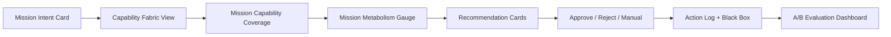
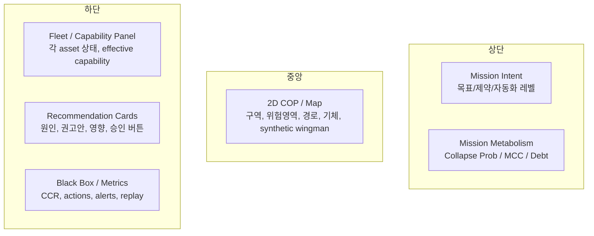
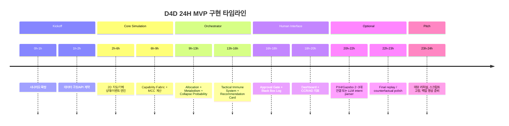

# D4D 해커톤용 Capability-centric Mission Metabolism MVP 구현 계획서

## Executive Summary

이 계획서는 D4D 해커톤의 **“1인 다중 무인기 동시 통제”** 문제를, 기존의 “다중 드론 관제 대시보드”가 아니라 **Capability-centric Mission Metabolism**이라는 새로운 운용 추상화로 풀기 위한 MVP 설계안이다. 핵심 가설은 단순하다. 미래 전장의 병목은 “드론을 더 잘 조종하는 것”이 아니라, **자주 손실되고 자주 교란되며 계속 재구성되는 다중 UxV 전력을 1명의 운용자가 임무 능력 단위로 유지하는 것**이다. 이 가설은 DARPA CODE가 제시한 “단일 감독자(supervisory commander)”, OFFSET이 강조한 “swarm commander’s intent”와 human-swarm interface, Replicator의 “attritable autonomous systems”, 우크라이나 전장에서 확인된 “저가·대량·교란 대응·소프트웨어 갱신 중심” 패턴과 정합적이다. citeturn4view1turn4view0turn4view2turn4view8turn19view0turn19view1

이 보고서가 제안하는 제품은 **기체 중심(vehicle-centric)** 관제가 아니라 **능력 중심(capability-centric)** 임무 운영체제다. 즉, 운용자는 “UxV-03을 어디로 보낼까?”보다 “현재 편대가 정찰·릴레이·감시·예비 능력을 몇 분 더 유지할 수 있는가?”를 본다. 이를 위해 본 계획서는 **Capability Fabric**, **Mission Metabolism**, **Autonomy Debt**, **Tactical Immune System**, **Command Compression Ratio**를 모두 계량화 가능한 형태로 정의하고, 해커톤 24시간 제약 안에서 구현 가능한 P0/P1 범위, API, 데이터 구조, UI 카드, A/B 실험 프레임워크, 5~7분 데모 스크립트까지 포함한다. 이 점은 D4D의 평가 항목인 문제 적합성, 군 적용 가능성, 기술 구현, 창의성에 직접 대응한다. D4D는 1차와 본선 모두 **3분 발표 + 2분 질의응답** 구조이고, 1차 평가에서 군 적용 가능성 비중이 30%, 문제 적합성과 기술 구현이 각각 25%, 창의성이 20%다. 따라서 MVP는 “멋진 시뮬레이션”보다 **짧은 시간 안에 정량적으로 설득 가능한 운용 개념**이어야 한다. citeturn0view0

실행 권고는 명확하다. **첫째**, 구현 1순위는 PX4/Gazebo 연동이 아니라 **2D mixed-fidelity 시뮬레이터**다. PX4/Gazebo는 공식적으로 다중기체와 ROS 2를 지원하지만, 해커톤 시간 안에 안정적으로 고충실도 multi-UxV를 띄우는 일은 리스크가 크다. 따라서 **“2D 오케스트레이터 + 선택적 PX4 고충실도 몇 대 + 나머지 synthetic wingman”** 구조가 가장 현실적이다. **둘째**, novelty는 새 제어 알고리즘보다 **새 KPI와 새 추상화**에서 만들어야 한다. 본 계획서는 이를 위해 **Mission Collapse Probability**, **Autonomy Debt**, **Command Compression Ratio**를 핵심 평가 지표로 삼는다. **셋째**, LLM은 자연어 의도 파싱과 설명 생성에만 제한적으로 쓰고, 기체 제어는 반드시 rule validator와 human approval gate 뒤에 둔다. 이는 DoD의 책임 있는 AI 원칙과 자율 시스템의 V&V, 인간 판단 보장 원칙과도 맞는다. citeturn8search2turn8search14turn8search1turn8search9turn20view0turn20view2

## 근거와 벤치마킹 패턴

D4D 공개 페이지는 자율·무인 시스템 및 Counter-UAS, 전장 네트워크/C2/COP, 시뮬레이션/훈련을 핵심 트랙으로 제시하고 있다. 즉, 이 문제는 단순한 비행제어 과제가 아니라 **다수의 무인체계를 적은 인원으로 통합 운용하는 자율·C2·시뮬레이션 문제**다. 따라서 심사 설득의 핵심은 “드론 제어를 구현했다”가 아니라 “적은 인원으로 더 많은 무인체계를 통제하게 만들었다”는 점을 **operationally** 입증하는 것이다. citeturn0view0

DARPA CODE는 이 문제를 거의 정면으로 다뤘다. CODE의 공식 설명은 무인기들이 **자신의 상태와 환경을 지속적으로 평가하고**, **조정된 UAS 행동에 대한 권고안을 mission supervisor에게 제시**하며, 인간은 이를 승인/거부하고 임무 변경을 지시하는 구조를 상정한다. 또 CODE는 **여러 운영자가 각 UAS를 붙잡는 구조에서, 1명의 mission commander가 임무에 필요한 모든 무인기를 동시에 지휘하는 구조**로의 전환을 목표로 했다. 특히 CODE는 “capability mix-and-match”를 강조하면서, 모든 능력을 한 기체에 통합하기보다 **특정 capability를 가진 여러 시스템을 임무에 맞게 조합하는 방식**이 손실과 예기치 않은 위협에 더 강하다고 보았다. 이 공식 문헌은 본 보고서의 Capability Fabric 개념을 직접적으로 정당화한다. citeturn4view1turn16view1

DARPA OFFSET은 다른 방향에서 중요한 힌트를 준다. OFFSET의 공식 설명에 따르면 프로그램 목적은 **swarm tactics를 빠르게 생성하고, 효과를 평가하고, 그 결과를 현장 운용으로 통합하는 것**이었다. 이를 위해 OFFSET은 **advanced human-swarm interface**, **swarm interaction grammar**, **실시간 네트워크 가상환경**, **community-driven tactics exchange**를 포함한 개방형 생태계를 구축했다. अंतिम field experiment에서는 **300개 이상 플랫폼**, **물리·가상 agent의 병행 운용**, **VR/AR/스케치/모바일 기반 immersive interface**가 동원됐다. OFFSET이 보여준 핵심 패턴은 “개별 조종”이 아니라 **commander intent → swarm tactics → simulation-backed evaluation**이다. 해커톤 MVP는 이 중 전술 생성 전체를 구현할 필요는 없지만, **임무 의도(card)**, **재계획 제안(card)**, **가상+실기체 혼합(agent)**, **what-if evaluation**은 강하게 차용할 가치가 있다. citeturn4view0turn16view2

Replicator는 “어떤 무인기가 좋은가”보다 “**대량의 저가 attritable autonomous systems를 얼마나 빨리 fielding할 수 있는가**”에 정책 초점을 둔다는 점에서 중요하다. DoD는 Replicator 1차 중점이 **all-domain attritable autonomous systems**와 c-UAS의 가속 fielding이라고 밝혔다. 이는 해커톤에서도 “고성능 완성형 1대”보다 **싸고 자주 손실되는 다수 자산을 소프트웨어적으로 재구성하는 능력**이 미래성으로 읽힌다는 뜻이다. Capability-centric Mission Metabolism은 հենց 이 방향과 맞는다. 시스템은 개별 기체의 identity가 아니라 **남아 있는 mission capability budget**을 관리하기 때문이다. citeturn4view2turn1search2

우크라이나 전장은 이 추상화를 현실화하는 가장 강한 근거다. CSIS는 우크라이나가 AI-enabled unmanned systems를 통해 **제한된 인력 보존**, **피로·스트레스·대량 데이터 융합 한계 극복**, **partial autonomy 확대**를 추구한다고 분석했고, 같은 CSIS의 또 다른 분석은 “현대 무인체계 운용은 대개 1기당 여러 명이 필요하며, 소프트웨어가 병목 탈출의 유일한 길”이라고 단언한다. Reuters는 2024년 우크라이나 내부 추정으로 **러시아 병력 타격의 69%, 차량/장비 타격의 75%가 드론에 의해 이뤄졌다**고 보도했고, 또 우크라이나 드론군 사령관 인터뷰에서는 **전자전 때문에 전통적 드론이 무력화되면서 AI 기반 터미널 유도와 릴레이형 “mothership” 개념이 확산**되고 있다고 전했다. RUSI는 우크라이나 교훈을 바탕으로 UAV를 **platform이 아니라 system**으로 취급해야 하며, 효과 유지를 위해 **소프트웨어, 행동 논리, 센서, 라디오를 6~12주마다 갱신**해야 한다고 지적했다. 이 일련의 근거는 “Mission Metabolism”과 “Tactical Immune System”이 단순한 비유가 아니라, 실제 전장에서 **계속 붕괴하고 계속 적응해야 하는 운용 현실**을 반영한 설계라는 점을 보여준다. citeturn4view8turn4view9turn12view1turn12view2turn19view0turn19view1

산업 사례도 같은 방향을 가리킨다. Shield AI는 Hivemind를 **GPS- 및 통신 교란 환경**, **autonomous mission execution**, **coordinated multi-agent teaming and swarming**을 지원하는 소프트웨어로 설명한다. 또한 Hivemind의 구성은 Edge, Design, Commander로 분리되어 있어, 현장 자율성·개발 반복·운용자 인터페이스를 모듈화한다. Anduril은 Lattice for Mission Autonomy와 C2 제품군에서 **다수 무인체계의 동적 협업**과 **수천 센서·이펙터 통합**을 내세운다. Auterion은 우크라이나에 **3만3천 개 AI guidance kit 제공**을 발표했고, Reuters 보도에 따르면 그 목적은 **최종 접근 구간에서 표적 형상을 락온해 전자전 재밍을 견디는 것**이었다. 2026년 Auterion 자사 발표는 단일 운용자가 3개 표적을 동시에 처리한 live-fire swarm 시연을 “one-to-many”의 증거로 내세웠다. 이 산업 패턴이 주는 교훈은 세 가지다. **첫째**, novelty는 기체보다 소프트웨어에 있다. **둘째**, 통신 상실 시에도 유지되는 onboard fallback autonomy가 중요하다. **셋째**, operator UX는 telemetry panel이 아니라 intent, approval, replay 중심이어야 한다. citeturn4view5turn11view3turn2search0turn2search7turn12view0turn4view6turn21view0

이상의 공통점을 압축하면, 해커톤에서 벤치마킹해야 할 패턴은 아래 표로 정리된다.

| 원천 사례 | 공식적으로 확인되는 패턴 | MVP에 옮길 방식 | 해커톤용 메시지 |
|---|---|---|---|
| DARPA CODE | 단일 인간 감독자, 권고안 제시, capability mix-and-match, degraded comm/GPS 대응 citeturn4view1turn16view1 | Fleet state self-evaluation, approval gate, capability allocation | “기체가 아니라 capability를 배정한다.” |
| DARPA OFFSET | commander intent, swarm tactics grammar, virtual environment, physical+virtual 혼합, 대규모 HSI citeturn4view0turn16view2 | Mission Intent Card, What-if planner, Synthetic Wingman | “의도를 입력하면 swarm tactic 수준으로 펼친다.” |
| Replicator | attritable autonomous systems의 대량 fielding citeturn4view2turn1search2 | attrition-aware allocation, expendability-aware score | “손실을 전제로 capability를 유지한다.” |
| Ukraine DELTA | 통합 전장 인식, 실시간 정보 공유, operational planning, AI 기반 자동 탐지 citeturn4view7 | COP-lite, event-fused battlefield layer | “상태판이 아니라 decision surface를 만든다.” |
| Ukraine/RUSI EW | EW 중심 전장, 6~12주 단위 소프트웨어 적응, layered employment, system-level thinking citeturn19view0turn19view1 | Mission Metabolism, Tactical Immune System | “정적 계획이 아니라 붕괴 예측과 자가 복구.” |
| Shield AI / Anduril / Auterion | GPS/comm denied 운영, modular autonomy stack, mission autonomy, one-to-many 운영 citeturn4view5turn11view3turn2search0turn12view0turn21view0 | mixed autonomy stack, approval cards, compression KPI | “하나의 intent가 여러 micro-action으로 압축된다.” |

이 표를 종합하면, **Capability-centric Mission Metabolism은 ‘전혀 없는 것’을 발명하는 개념이 아니라, 기존 강자들이 따로따로 입증한 패턴을 ‘능력 예산 관리 + 붕괴 확률 + 자율성 부채’라는 하나의 운영 레이어로 재구성한 것**이라고 보는 편이 정확하다. 즉, novelty의 위치는 센서나 기체가 아니라 **운용 추상화와 계량 지표**에 있다. 이 판단은 공개 स्रोत 기준으로도 충분히 방어 가능하다. citeturn4view0turn4view1turn4view2turn19view0turn11view3

## 핵심 개념과 계량 모델

아래 정의들은 기존 공식 문헌에 그대로 존재하는 표준식이 아니라, **DARPA·우크라이나·산업 패턴을 바탕으로 해커톤 MVP용으로 제안하는 계량 모델**이다. 따라서 식 자체는 본 계획서의 설계 산출물이고, 설계 철학은 capability mix-and-match, adaptive autonomy, operator workload reduction, degraded-comm resilience라는 기존 연구·사례에 근거한다. citeturn4view1turn13view1turn13view4turn13view3

### Capability Fabric

Capability Fabric은 각 기체 \(i\)를 “드론 1대”가 아니라 능력 벡터 \( \mathbf{c}_i \)로 표현하는 계층이다. 권장 capability 축은 최소한 다음 다섯 개다.

- \(k_1\): visual recon
- \(k_2\): relay
- \(k_3\): persistent overwatch
- \(k_4\): GPS-denied navigation
- \(k_5\): reserve / replaceability

각 기체의 원시 능력값은 \(c_{ik}\in[0,1]\)로 둔다. 예컨대 고성능 카메라 UAV는 visual recon이 0.9, 릴레이는 0.4, 지상 UGV는 visual recon 0.5, relay 0.2처럼 설정한다. 다만 실제 운용에서는 기체 상태가 계속 변하므로, 임무 시점 \(t\)의 가용성 계수 \(a_i(t)\)를 결합한 **유효 능력** \(e_{ik}(t)\)를 써야 한다. 계산은 다음과 같이 두는 것이 구현과 설명 가능성의 균형이 좋다.

\[
a_i(t)=\prod_{m\in\{battery,comm,nav,sensor,health\}} q_{im}(t)^{\omega_m}, \quad \sum_m\omega_m=1
\]

\[
e_{ik}(t)=c_{ik}\cdot a_i(t)
\]

여기서 \(q_{im}(t)\in[0,1]\)은 정규화된 상태 점수다. 예를 들어 battery 0.31, comm 0.85, nav 0.90, sensor 1.0, health 0.95이고 가중치가 각기 0.25/0.25/0.2/0.2/0.1이면 \(a_i(t)\)는 단순 평균보다 “약한 고리”에 더 민감한 값이 된다. 이는 CODE가 말한 self-state evaluation과 capability-based teaming, 그리고 최근 MH-MR task allocation 연구가 강조하는 상태 불확실성과 이질성 반영 원칙과 잘 맞는다. citeturn4view1turn13view3

임무가 요구하는 capability demand를 \(R_{\tau,k}\)로 두면, task \(\tau\)에 대한 coverage는 다음으로 계산할 수 있다.

\[
\text{Cov}_{\tau,k}(t)=\min\left(1,\frac{\sum_i x_{i\tau}(t)e_{ik}(t)}{R_{\tau,k}+\epsilon}\right)
\]

여기서 \(x_{i\tau}(t)\in\{0,1\}\) 또는 \([0,1]\)는 기체와 task 간 배정 변수다. 전체 Mission Capability Coverage는 task 중요도 \(\lambda_\tau\)와 capability 중요도 \(w_k\)를 곱해 집계한다.

\[
\text{MCC}(t)=\sum_{\tau}\lambda_\tau \sum_k w_k\, \text{Cov}_{\tau,k}(t)
\]

이 지표는 공개 사례에서 직접 제시된 표준 KPI는 아니지만, DARPA CODE의 “상이한 capability를 가진 플랫폼 조합”과 Ukraine/DELTA의 COP식 전장 정보 통합을 **운용자용 한 화면 숫자**로 변환한다는 점에서 설명력이 높다. citeturn4view1turn4view7

### Mission Metabolism

Mission Metabolism은 “현재 임무가 살아남을 수 있는가”를 보는 지표다. 핵심은 특정 기체의 배터리 경고가 아니라, **향후 짧은 예측지평 \(H\)** 동안 임무 능력 수요를 충족할 수 있는지를 보는 것이다. RUSI가 UAV를 platform이 아니라 system으로 보고, layered employment와 continual updates가 필수라고 한 이유도 결국 임무가 대사적으로 소모되기 때문이다. 우크라이나 전장의 EW·교란·교체 속도는 이 지표의 실전적 필요성을 높인다. citeturn19view0turn19view1turn12view2

우선 capability \(k\)에 대한 예측 수요와 공급을 다음처럼 정의한다.

\[
D_k(H|t)=\int_t^{t+H} R_k(u)\,du
\]

\[
S_k(H|t)=\sum_i \int_t^{t+H} x_{ik}(u)e_{ik}(u)\,du
\]

deficit ratio는

\[
\Delta_k(H|t)=\max\left(0,\frac{D_k(H|t)-S_k(H|t)}{D_k(H|t)+\epsilon}\right)
\]

로 둔다. 그 다음 대사 스트레인 \(\text{Strain}(t)\)를 capability deficit, EW pressure, 통신 혼잡, 운용자 부하, 손실 위험, 중복성으로 구성한다.

\[
\text{Strain}(t)=
\sum_k w_k\Delta_k(H|t)
+\alpha \,\text{EW}(t)
+\beta \,\text{CommSat}(t)
+\gamma \,\text{OpLoad}(t)
+\delta \,\text{AttritionRisk}(t)
-\rho \,\text{Redundancy}(t)
\]

이때 Mission Collapse Probability는 로지스틱 형태로 두면 구현이 쉽다.

\[
P_{\text{collapse}}(H|t)=\sigma\left(\theta_0+\theta_1\text{Strain}(t)\right)
\]

MVP에서는 \(\theta\)를 학습하지 말고 heuristic으로 두는 편이 낫다. 예를 들어 \(\theta_0=-2.0\), \(\theta_1=3.0\)이면 Strain 0.2는 붕괴확률 약 0.35, Strain 0.6은 약 0.77이 된다. 이 수치는 절대적 진실이 아니라 **비교용 operational risk score**다. 중요한 것은 “UxV-02 배터리 17%”보다 “**현재 구성 유지 시 B구역 임무 붕괴 확률 43%**”를 보여준다는 점이다. 이는 Reuters가 보도한 우크라이나식 EW 포화 환경과, CODE/Shield AI가 추구한 degraded comm에서도 intent 유지 구조를 심사위원에게 한 번에 설명해 준다. citeturn12view2turn16view0turn4view5

### Autonomy Debt

Autonomy Debt는 본 계획서가 제안하는 신규 지표로, **현재 자동화 구성 때문에 미래에 인간이 갚아야 할 판단 부채**를 의미한다. flexible autonomy 연구는 임무 상태와 인간 상태에 따라 autonomy level을 조절해야 한다고 보고, workload reduction 연구들은 자동화 전략이 인간 상태와 mission performance를 동시에 봐야 한다고 지적한다. Autonomy Debt는 그 논점을 제품 KPI로 바꾼 것이다. citeturn13view4turn13view2turn13view1

정의는 다음처럼 누적형으로 두는 것이 직관적이다.

\[
AD_{t+1}=\lambda AD_t
+a_1N_{\text{pending}}(t)
+a_2\text{SinglePointRisk}(t)
+a_3\big(\text{Uncertainty}(t)\cdot \text{AutoLevel}(t)\big)
+a_4\text{AlertBacklog}(t)
+a_5\text{CapabilityDeficit}(t)
-a_6\text{RecoveryActions}(t)
\]

이 값을 0–100으로 min-max 정규화해 표시한다. 여기서
- \(N_{\text{pending}}\): 승인 대기 카드 수
- SinglePointRisk: 릴레이/탐지/예비 능력의 단일 실패점 위험
- Uncertainty × AutoLevel: 불확실한 상태에서 자동화 강도가 높을수록 debt 증가
- AlertBacklog: 미처리 경고 누적
- CapabilityDeficit: MCC 하락분
- RecoveryActions: 시스템이 이미 수행한 자가복구 행동 수

가령 릴레이 중복성이 사라지고, 통신 저하가 누적되고, 승인 대기 카드가 4개 쌓였는데 자동화 레벨이 높게 유지되면 AD가 급상승한다. 반대로 warning suppression, reserve activation, relay repositioning이 자동으로 처리되면 AD가 감소한다. 이 지표는 “운용자 인지부하”를 미래지향적으로 포착한다는 점에서 단순 alert count보다 훨씬 설득력이 있다. citeturn13view4turn13view1

### Tactical Immune System

Tactical Immune System은 교란·손실·고장 발생 시 전체 플랜을 매번 다시 짜지 않고, **국소 복구(local recovery)** 를 실행하는 규칙 집합이다. RUSI가 전자전을 “force-wide business”라고 부른 이유는 EW가 이제 일부 specialist만의 문제가 아니라 모든 echelon의 cohesion을 흔드는 요소이기 때문이다. 또한 Ukraine 전장에서는 relay, fiber-optic, automated targeting, decoy/interceptor 같은 적응형 대응이 빠르게 확산했다. Tactical Immune System은 이 현실을 **event → localized response** 방식으로 제품화한다. citeturn19view1turn12view1turn12view2

이벤트 \(e\)가 발생했을 때 가능한 반응 집합 \(R(e)\) 중 최적 응답 \(r^*\)를 고른다.

\[
r^*=\arg\max_{r\in R(e)}\left[\Delta \text{MCC}(r)-\mu \Delta \text{OpActs}(r)-\nu \Delta \text{Risk}(r)\right]
\]

예시 반응 라이브러리는 아래처럼 작게 시작하면 된다.

| 이벤트 | 후보 반응 |
|---|---|
| comm_jam | relay 재배치, 저대역폭 모드, 해당 기체 임무 축소 |
| gps_drop | 저속 모드, hold, GPS-dependent task 배제 |
| battery_drop | 귀환, 근거리 task로 축소, reserve 치환 |
| sensor_fail | scout → relay/reserve 전환 |
| vehicle_lost | nearest reserve 투입, coverage 재분배 |
| alert_flood | low-priority suppression, 카드 병합 |

MVP에서는 위 반응을 행동트리가 아니라 규칙 + 점수화 카드 형태로 구현하는 편이 낫다. 이는 CODE의 “recommendations to supervisor”와 OFFSET의 action grammar를 해커톤용으로 축소한 형태다. citeturn4view1turn4view0

### Command Compression Ratio

CODE의 2018 실험은 **minimal human commands**를 공식적으로 강조했고, 최근 LLM 기반 human-swarm 연구들은 high-level intent를 low-level swarm command로 변환하는 “intention-to-action gap”을 병목으로 본다. Command Compression Ratio는 이 병목을 정량화하는 지표다. citeturn16view0turn17search0turn17search2

두 개의 비율을 함께 쓰는 것이 좋다.

\[
CCR_{\text{ext}}=\frac{\text{Baseline operator actions}}{\text{Assisted operator actions}}
\]

\[
CCR_{\text{int}}=\frac{\text{System micro-actions executed}}{\text{Human intents or approvals}}
\]

예를 들어 baseline에서 운용자가 경로 수정, 귀환, 릴레이 이동, 팀 재배치에 28번 조작해야 하는데 assisted 모드에서는 카드 승인 4번이면 \(CCR_{ext}=7.0\times\)다. 동시에 시스템이 내부적으로 19개의 micro-action을 전개했다면 \(CCR_{int}=4.75\times\)다. 이 지표의 장점은 심사위원에게 “클릭 수 감소”보다 훨씬 강한 메시지를 준다는 점이다. **“한 개의 임무 의도가 몇 개의 실행 가능한 행위로 압축·전개되었는가”**를 보여주기 때문이다. citeturn16view0turn17search0

### 예시 계산

아래는 MVP 화면에서 바로 보여줄 수 있는 샘플 계산이다. 수치는 예시이며, formula sanity check용이다.

| 항목 | 재밍 전 | 재밍 후 | 면역 반응 후 |
|---|---:|---:|---:|
| B구역 relay coverage | 1.08 | 0.62 | 0.97 |
| B구역 recon coverage | 0.91 | 0.54 | 0.88 |
| EW pressure | 0.10 | 0.70 | 0.32 |
| OpLoad | 0.25 | 0.66 | 0.31 |
| Autonomy Debt | 19 | 58 | 27 |
| Collapse Probability 3분 horizon | 0.18 | 0.64 | 0.26 |

이 표는 “왜 Tactical Immune System이 필요한가”를 5초 안에 설명해 준다. 특히 재밍 후 coverage deficit과 operator load가 동시에 커지고, 회복 후 둘 다 떨어지는 모습은 우크라이나식 contested environment와 D4D의 운용자 병목 문제를 한 번에 보여준다. 공개 사례들이 보여준 degraded comm/GPS 대응, relay·mothership, human approval, capability recomposition 패턴을 MVP용 숫자로 번역한 결과다. citeturn12view2turn16view0turn4view5

## 해커톤 MVP 설계

이 MVP의 최상위 목표는 **“하나의 임무 의도 입력으로 다수 UxV의 capability budget을 유지·복구하는 오케스트레이터”**를 보여주는 것이다. 즉, 비행제어보다 **상태 집계, 역할 배정, 붕괴 예측, 국소 복구, 인간 승인 레이어**가 중심이다. 이는 D4D 트랙의 Autonomy, C2/COP, Simulation 요구와 정합적이며, judging 관점에서 deployability와 creativity를 동시에 노릴 수 있다. citeturn0view0

### MVP 목표와 시나리오

권장 MVP 시나리오는 **4대 UAV + 2대 UGV + 선택적 12~24대 synthetic wingman**이다. 실제 high-fidelity는 2~4대만 운용해도 충분하고, 나머지는 2D synthetic asset으로 capability layer에 얹는다. 이렇게 해야 PX4/Gazebo의 리스크를 낮추면서도 “1인 다중”의 스케일을 보여줄 수 있다. RISE/RISE-like 연구가 live, virtual, constructive와 fluid fidelity를 통해 physical/virtual agent를 함께 운용하고 150:1 이상 operator ratio를 시연한 점은 mixed-fidelity 전략의 타당성을 뒷받침한다. citeturn14view0turn14view1turn14view2

권장 초기 기체 구성은 아래와 같다.

| 기체 | 형식 | 기본 capability 강점 | 초기 상태 예시 |
|---|---|---|---|
| UxV-01 | UAV | visual recon, overwatch | battery 0.82, comm 0.93 |
| UxV-02 | UAV | short recon, expendable probe | battery 0.31, comm 0.88 |
| UxV-03 | UAV | visual recon | battery 0.69, comm 0.54 |
| UxV-04 | UAV | relay, reserve | battery 0.91, comm 0.97 |
| UxV-05 | UGV | persistent overwatch, close inspection | battery 0.76, GPS 0.38 |
| UxV-06 | UGV/UAV | reserve replacement | battery 0.88 |
| SW-01~24 | synthetic wingman | low-fidelity scouts/decoys/relay fragments | 상태 랜덤 |

임무는 “A/B/C 세 구역 ISR 연속성 유지, B구역 통신 음영 대응, 최소 1단위 relay redundancy 유지, 배터리 20% 이하 귀환, 목표 MCC 0.80 이상 유지” 정도가 적당하다. 이벤트는 T+90s에 B구역 jammer zone 발생, T+120s에 UxV-02 battery drop, T+150s에 UxV-03 comm degradation, T+180s에 no-go zone 생성으로 설계하면 5~7분 데모 안에서 narrative가 분명해진다. 이 구조는 CODE/Ukraine 사례에서 공통으로 드러난 **degraded comm/GPS + attrition + reallocation** 패턴을 해커톤용으로 압축한 것이다. citeturn16view0turn12view2turn19view1

### 기능 우선순위 표

아래 표는 요청한 산출물 (A)인 요약 테이블이다. 책임자는 역할 기준 예시이며, 실제 팀원 이름은 **미지**이므로 역할명으로 표기했다.

| 기능 | 우선순위 | 책임자 | 예상 소요시간 | 난이도 | 구현 핵심 |
|---|---|---|---:|---|---|
| Capability Fabric 계산기 | P0 | Algo/BE | 4h | 중 | 기체 상태 → effective capability |
| Mission Intent Card | P0 | FE/UX | 3h | 하 | 폼/JSON 기반 임무 의도 입력 |
| Mission Capability Coverage 대시보드 | P0 | FE | 4h | 중 | capability bar, deficit 표시 |
| Mission Metabolism 계산기 | P0 | Algo | 5h | 중상 | horizon 기반 collapse risk |
| Event Simulator | P0 | Sim/BE | 5h | 중 | jammer, battery, GPS, loss |
| Tactical Immune System 규칙 엔진 | P0 | Algo/BE | 6h | 중상 | 이벤트별 국소 복구안 생성 |
| Recommendation Card + Approval Gate | P0 | FE/BE | 5h | 중 | 승인/거절/수동개입 |
| Command Compression 로그 | P0 | BE | 2h | 하 | intent 수, micro-action 수 기록 |
| Autonomy Debt 계산기 | P0 | Algo | 4h | 중 | backlog/risk 누적 점수 |
| A/B Evaluation Dashboard | P0 | FE/BE | 5h | 중 | baseline vs assisted 비교 |
| 2D 지도/COP 뷰 | P0 | FE | 6h | 중 | 구역, 경로, 위험영역, asset 표시 |
| PX4/Gazebo 2~3대 연동 | P1 | Sim | 8h | 상 | telemetry bridge |
| ROS 2 topic bridge | P1 | Sim/BE | 6h | 상 | px4 uORB ↔ app translators |
| Voice/LLM intent parser | P1 | FE/BE | 4h | 중 | JSON parse only |
| Counterfactual Replay | P1 | BE | 4h | 중 | “그때 다르게 했으면?” 비교 |
| Mission Black Box exporter | P1 | BE | 3h | 하 | decision log, JSON dump |

### UI/UX 흐름

가장 중요한 UX 원칙은 **“모든 telemetry를 보여주지 않는다”**다. DARPA OFFSET이 immersive decision presentation을 강조했고, 최근 human-swarm/field robotics 연구도 operator workload를 줄이려면 context-aware action suggestion과 adaptive interface가 중요하다고 본다. 따라서 화면은 “상황판”이 아니라 **판단 카드 중심**이어야 한다. citeturn4view0turn13view1turn13view2

권장 UI 흐름은 다음과 같다.



권장 메인 화면 와이어프레임은 다음과 같다.



카드 예시는 아래 형태가 좋다.

```text
[승인 필요] B구역 임무 대사 불안정

원인
- UxV-02 battery 17%
- UxV-03 packet loss 34%
- relay redundancy 1 → 0

권고
- UxV-02 귀환
- UxV-06 short recon 투입
- UxV-04 relay 위치 120m 동쪽 재배치

예상 변화
- MCC 0.71 → 0.87
- Collapse Prob 0.64 → 0.26
- Autonomy Debt 58 → 27
- operator actions +1

[승인] [거절] [수동]
```

이 카드 설계는 CODE의 recommendation structure, Shield AI의 Commander 계층, and DELTA류 COP의 decision support 철학을 **해커톤 크기**로 축소한 것이다. citeturn4view1turn11view3turn4view7

### API 및 데이터 구조 요약

아래는 요청한 API/데이터 구조 요약 테이블이다.

| 엔드포인트 | 메서드 | 핵심 입력 | 핵심 출력 | 목적 |
|---|---|---|---|---|
| `/mission` | POST | objective, areas, constraints | mission_id | 임무 생성 |
| `/fleet/state` | GET | 없음 | vehicles[] | 실시간 상태 조회 |
| `/capability/compute` | POST | vehicles, mission | effective_capabilities | Capability Fabric 계산 |
| `/allocate` | POST | mission_id, fleet_state | assignments, explanations | 초기 배정 |
| `/event/inject` | POST | event_type, target, severity | updated_state | 이벤트 주입 |
| `/metabolism/evaluate` | POST | mission_id, horizon | MCC, strain, collapse_prob | 대사 평가 |
| `/immune/respond` | POST | current_state, event | recommendation_card | 국소 복구안 생성 |
| `/decision` | POST | recommendation_id, approve/reject/manual | new_plan | 인간 개입 |
| `/metrics` | GET | run_id | CCR, AD, MCC, alerts | 평가 수집 |
| `/replay` | GET | run_id | timeline, counterfactuals | 사후 분석 |

핵심 데이터 구조는 다음 세 개면 충분하다.

```json
{
  "Vehicle": {
    "id": "UxV-04",
    "type": "UAV",
    "state": {
      "battery": 0.91,
      "comm": 0.97,
      "nav": 0.94,
      "sensor": 0.82,
      "health": 0.95
    },
    "capabilities": {
      "visual_recon": 0.55,
      "relay": 0.93,
      "overwatch": 0.42,
      "gps_denied_nav": 0.48,
      "reserve": 0.71
    }
  }
}
```

```json
{
  "Mission": {
    "areas": ["A", "B", "C"],
    "requirements": {
      "visual_recon": 0.8,
      "relay": 1.0,
      "reserve": 0.3
    },
    "constraints": {
      "return_battery_threshold": 0.2,
      "min_relay_redundancy": 1,
      "human_approval_for_replan": true
    }
  }
}
```

```json
{
  "RecommendationCard": {
    "severity": "high",
    "title": "B area mission instability",
    "causes": ["battery_drop", "comm_degraded"],
    "actions": [
      {"vehicle": "UxV-02", "action": "return"},
      {"vehicle": "UxV-06", "action": "replace_short_recon"},
      {"vehicle": "UxV-04", "action": "reposition_relay"}
    ],
    "expected_effect": {
      "mcc_delta": 0.16,
      "collapse_prob_delta": -0.38,
      "autonomy_debt_delta": -31
    }
  }
}
```

## 시뮬레이션과 개발 스택 제안

기술 스택은 **“성공 확률이 높은 것부터”** 정해야 한다. PX4 공식 문서는 Gazebo를 현재 권장 시뮬레이터로 제시하고, Ubuntu 22.04 이상에서는 새 Gazebo가 지원되며, multi-vehicle simulation, rover, camera, VTOL 등을 지원한다고 밝힌다. 또한 PX4는 ROS 2와 uXRCE-DDS를 통해 깊은 통합을 제공하고, MAVSDK는 telemetry와 state query를 단순한 API로 노출한다. 즉, 이론적으로는 **PX4 + Gazebo + ROS 2 + MAVSDK**가 가장 정석적이다. 하지만 같은 공식 문서가 보여주듯 multi-vehicle, ROS 2, DDS bridge, stream port 관리까지 얽히면 세팅 리스크가 급증한다. 해커톤 24시간에서는 이 리스크를 감당할 이유가 없다. citeturn4view3turn8search0turn8search1turn8search9turn7search2turn7search0

따라서 권장 아키텍처는 **이중 경로**다.

### 권장 스택

| 계층 | 권장안 | 이유 |
|---|---|---|
| Frontend | React + TypeScript + Vite + Zustand | 빠른 상태관리와 카드 UI |
| Backend | Python FastAPI | 계산식, 시뮬레이션, REST API 빠름 |
| 2D Simulator | Custom canvas/MapLibre/Leaflet | fallback 필수 |
| High-fidelity Air | PX4 SITL + Gazebo | 공식 지원, multi-vehicle 가능 |
| Middleware | MAVSDK 우선, ROS 2 선택 | telemetry 읽기 쉬움; ROS 2는 P1 |
| Data bus | WebSocket + REST | 카드/대시보드 실시간 반영 |
| Logs | SQLite/JSONL | black box·replay용 |

PX4는 multi-vehicle simulation을 공식 지원하며 Gazebo가 swarm scenarios와 computer vision 기능에 더 적합하다고 명시한다. 반면 JMAVSim은 쉬운 다중기체 테스트에 적합하지만, swarm이나 vision 기능에는 Gazebo가 더 낫다. 따라서 **P1의 고충실도 시연**은 PX4/Gazebo, **P0의 생존성**은 2D simulator에 두는 것이 합리적이다. citeturn8search0turn8search2turn8search12turn8search18

### Synthetic Wingman 설계

Synthetic Wingman은 **혼합 충실도(mixed fidelity)** 를 통해 스케일을 확보하는 방법이다. RISE 논문은 250개 이상 heterogeneous agents, live/virtual/constructive simulation, fluid fidelity, 150:1 이상의 operator ratio를 보고한다. 이 아이디어를 해커톤에 맞게 축소하면 아래처럼 된다. citeturn14view0turn14view1turn14view2

- **Tier A**: PX4/Gazebo 실제 시뮬레이터 기체 2~4대  
  고충실도 위치, heading, battery, telemetry, reroute 시연
- **Tier B**: 2D 물리기반 UGV/UAV 2~4대  
  comm zone, jammer, no-go zone, attrition 시뮬레이션
- **Tier C**: synthetic wingman 12~24대  
  capability token만 존재, 고빈도 이벤트에 반응, map 상 아이콘만 렌더

핵심은 운용자 UI가 Tier 구분을 드러내지 않는 것이다. 운용자는 실제로 몇 대가 Gazebo인지 신경 쓰지 않고 **MCC, collapse probability, debt**만 본다. 이렇게 하면 “하드웨어가 없다”는 약점을 오히려 **미래형 LVC 운용개념**으로 뒤집을 수 있다. citeturn14view0

### 2D 시뮬레이터 설계 원칙

2D simulator는 그냥 fallback이 아니라, **Capability-centric Mission Metabolism의 핵심을 가장 잘 보여주는 환경**이어야 한다. 필요한 기능은 아래만 있어도 충분하다.

- 영역 A/B/C, no-go zone, jammer zone, comm shadow
- 기체 이동 속도, 배터리 drain, comm probability
- 이벤트 주입기
- 역할 배정과 경로 업데이트
- synthetic asset spawn/despawn
- replay scrubber

이 설계는 Gazebo가 제공하는 물리·센서 fidelity를 포기하는 대신, **mission-level control logic**을 빠르게 증명한다. Gazebo 자체도 sensor models, noise models, camera/LiDAR/GPS/IMU 등을 강점으로 내세우므로, 최종 제품 확장 단계에서 고충실도 실험으로 이전하기 쉽다. citeturn15search0turn15search4turn15search5turn15search6

### 구현 우선순위와 마일스톤

권장 구현 순서는 아래와 같다.

1. 2D simulator + 기체 상태 모델
2. Capability Fabric 계산
3. Mission Intent Card
4. Allocation + MCC 계산
5. Event simulator
6. Mission Metabolism / collapse probability
7. Recommendation card + approval gate
8. Autonomy Debt + CCR 로그
9. A/B dashboard
10. PX4/Gazebo optional bridge

요청한 산출물 (B)인 타임라인은 아래처럼 잡는 것이 현실적이다. 실제 해커톤은 24시간이므로, “기능 완성”보다 **P0 end-to-end 동작 시점**을 앞당기는 것이 중요하다. citeturn0view0



## 평가 프레임워크와 데모 전략

해커톤에서 가장 설득력 있는 산출물은 기능 목록이 아니라 **정량적 개선**이다. D4D 평가가 problem fit, deployability, technical execution을 강하게 보므로, “실제로 1인 다중 통제 병목이 줄었는가”를 수치로 보여줘야 한다. DARPA CODE도 minimal human commands를, OFFSET도 tactics evaluation을, human-swarm 연구는 workload와 mission performance의 동시 최적화를 강조했다. citeturn16view0turn4view0turn13view4turn13view2

### 실험 디자인

실험은 반드시 **paired A/B** 구조로 한다.

- **Baseline**
  - 운용자가 각 기체 역할을 직접 배정
  - 이벤트 발생 시 수동 재배정
  - 카드 추천 없음
- **Assisted**
  - Capability Fabric + Mission Metabolism + 카드 추천
  - 운용자는 승인 지점만 처리
  - low-priority alert suppression 적용

시나리오 패밀리는 최소 4개가 좋다.

| 시나리오 패밀리 | 주요 변수 |
|---|---|
| Battery stress | 저배터리 자산 다수 |
| EW contested | jammer, packet loss, GPS drop |
| Attrition | 1~2대 손실 |
| Command overload | alert flood, no-go zone, priority shift |

각 패밀리마다 10개 시드를 돌리면 **총 40쌍**의 baseline-assist 비교가 가능하다. 시간이 더 있으면 5패밀리 × 10시드 = 50쌍으로 늘린다. 실험 자동 반복은 human subject 없이도 가능하고, live demo는 그중 대표 1건만 보여주면 된다. 인간 실험 참가자 수는 해커톤 환경상 **미지**이므로, human-in-the-loop 지표는 “live demo supplementary”로 두고, 본평가는 시뮬레이션 반복으로 확보하는 것이 안전하다. 이 접근은 human experiments의 제약 때문에 modeling and simulation이 유용하다고 본 HSI literature와도 맞는다. citeturn13view4turn13view1

### 핵심 정량 지표

| 지표 | 정의 | 측정 방법 | 기대 방향 |
|---|---|---|---|
| Mission Capability Coverage | capability demand 충족도 | MCC 식 | ↑ |
| Mission Collapse Probability | horizon H 내 붕괴 확률 | Metabolism 식 | ↓ |
| Autonomy Debt | 미래 인간 개입 부채 | AD 식 | ↓ |
| Command Compression Ratio | intent 대비 micro-action 압축 | CCR_ext / CCR_int | ↑ |
| Operator Actions | 클릭/명령/수동조작 수 | UI log | ↓ |
| Replan Time | 이벤트→새 계획 확정 시간 | log timestamp | ↓ |
| Alert Backlog | 미처리 카드 수 | event queue | ↓ |
| Recovery Success | 이벤트 후 MCC 회복률 | post-event delta | ↑ |
| Reserve Preservation | 예비 capability 유지율 | reserve coverage | ↑ |

실무적으로 가장 강한 4개는 **Collapse Probability, Autonomy Debt, CCR, Operator Actions**다. 이 네 개만으로도 “우리는 진짜 1인 병목을 줄였다”는 메시지가 선다. 특히 Collapse Probability와 Autonomy Debt는 새로워 보이고, CCR은 발표 문구가 강하다. citeturn16view0turn17search0

### 통계적 유의성 확보 방안

해커톤 수준에서 “통계적으로 유의하다”를 과장하면 역효과가 난다. 대신 **재현성 있는 반복 실험**을 보여주는 편이 낫다.

- 동일 시드/동일 초기 상태로 baseline vs assisted paired run 수행
- 각 시나리오 패밀리별 최소 10 seeds
- 결과는 평균 + 표준편차 + 95% bootstrap CI 제시
- 정규성 가정이 맞으면 paired t-test, 아니면 Wilcoxon signed-rank
- effect size는 Cliff’s delta 또는 Cohen’s d 병기

예시 문구는 이렇게 가면 된다.

> “40 paired runs에서 assisted 모드는 baseline 대비 operator actions를 평균 61% 줄였고, mission collapse probability를 평균 34%p 낮췄습니다. paired test 기준 유의했고, seed를 바꿔도 방향성이 유지됐습니다.”

이건 academic perfection이 아니라 **judge-friendly rigor**다. 해커톤에서 이 정도면 충분히 강하다.

### 5~7분 데모 플로우

D4D의 실제 심사는 3분 발표 + 2분 질의응답 구조이므로, 본선까지 가더라도 메시지 압축이 필수다. 따라서 아래 데모는 **약 5분 안팎**으로 설계한다. citeturn0view0

#### 오프닝 화면

**화면**: 타이틀 + 한 문장  
**대사**

> “현재 다중 무인기 운용의 병목은 기체 수가 아니라 조종사 수입니다. 저희는 기체를 관리하는 대신 임무 능력을 관리하는 운영체제를 만들었습니다.”

#### 임무 입력

**화면**: Mission Intent Card  
**대사**

> “운용자는 ‘A/B/C 정찰, B구역 relay redundancy 1 유지, 배터리 20% 미만 귀환’만 입력합니다. 여기서부터 기체별 수동 조종은 제거됩니다.”

#### Capability Fabric

**화면**: 각 자산의 capability bar  
**대사**

> “각 UxV는 배터리와 기체 상태가 아니라 visual recon, relay, overwatch 같은 capability 벡터로 표현됩니다. 지금 임무는 기체가 아니라 능력 예산을 봅니다.”

#### Initial Allocation

**화면**: MCC 0.89, collapse 0.18, debt 19  
**대사**

> “초기 계획에서는 B구역 relay와 A/C 정찰이 모두 충족됩니다. 한 명은 이 숫자만 보면 됩니다.”

#### Event Injection

**화면**: jammer zone 등장, UxV-02 battery drop, UxV-03 packet loss  
**대사**

> “이제 contested environment를 주입하겠습니다. 재밍과 배터리 급락으로 B구역 capability가 붕괴하기 시작합니다.”

#### Metabolism Alert

**화면**: Collapse 0.18 → 0.64, Debt 19 → 58  
**대사**

> “중요한 건 개별 경고가 아닙니다. 현재 구성 유지 시 B구역 임무 붕괴 확률이 64%라는 점입니다. Autonomy Debt도 급등합니다.”

#### Tactical Immune System Card

**화면**: Recommendation Card  
**대사**

> “시스템은 국소 복구안을 제안합니다. UxV-02 귀환, UxV-06 대체 투입, UxV-04 relay 재배치. 운용자는 승인만 하면 됩니다.”

#### Recovery

**화면**: MCC 0.87, collapse 0.26, debt 27  
**대사**

> “승인 한 번으로 capability coverage가 복구됩니다. 포인트는 기체를 다시 날리는 게 아니라, 잃어버린 임무 능력을 회복했다는 점입니다.”

#### Evaluation Dashboard

**화면**: baseline vs assisted  
**대사**

> “동일 시나리오에서 baseline 대비 assisted는 operator actions 28→4, replan time 46초→11초, collapse probability 평균 34%p 감소를 보였습니다. 저희의 KPI는 drone count가 아니라 command compression ratio와 autonomy debt입니다.”

#### 클로징

**화면**: 제품 문장  
**대사**

> “이 시스템은 더 많은 드론을 조종하게 해주는 UI가 아닙니다. 자주 손실되고 자주 교란되는 다중 UxV를 한 명이 임무 능력 단위로 유지하도록 만드는 capability-centric mission OS입니다.”

### 피칭 포인트

심사위원이 물을 질문은 대체로 세 가지다.

첫째, **“이게 왜 새로운가?”**  
정답은 “제어 알고리즘이 새롭다”가 아니라, **capability coverage / collapse probability / autonomy debt**라는 운영 레이어가 새롭다고 답하면 된다. 이는 공개 DARPA/산업 체계가 입증한 조각을 하나의 운용 abstraction으로 통합한 것이다. citeturn4view0turn4view1turn4view2

둘째, **“왜 시뮬레이션만으로도 의미가 있나?”**  
정답은 D4D 자체가 하드웨어뿐 아니라 simulation, battle network, training 문제를 공식 트랙으로 제시한다는 점, 그리고 현재 병목이 기체 제어가 아니라 1인 다중 통제 logic라는 점을 강조하면 된다. 공식 PX4/Gazebo 문서도 multi-vehicle, rover, camera, ROS 2 bridge를 지원하므로 향후 확장은 자연스럽다. citeturn0view0turn8search2turn4view3turn8search1

셋째, **“실전성이 있나?”**  
정답은 우크라이나 전장의 EW/attrition/relay/AI terminal guidance 패턴과 RUSI의 “platform이 아니라 system, 6~12주 업데이트” 분석, CSIS의 “software is the only way out”를 묶어 설명하면 된다. citeturn12view2turn19view0turn4view9

## 리스크·윤리·안전 고려사항

이 MVP는 국방 맥락에 놓여 있지만, 해커톤 산출물은 **무기화가 아니라 운용·감시·정찰·윤리적 자율 운용 보조**로 포지셔닝해야 한다. Reuters가 보도한 우크라이나 사례에서도 AI는 terminal guidance 보조에 쓰이지만, 인간이 최종 strike 결정을 해야 한다는 원칙이 반복된다. DoD의 AI 윤리 원칙과 DoD Directive 3000.09 역시 **적절한 수준의 인간 판단**, **V&V/T&E**, **예상치 못한 행동 시 비활성화/중지**, **운용자가 시스템의 기능·한계 이해**를 요구한다. 따라서 해커톤 MVP는 기술적으로 가능하더라도 strike automation을 전면에 내세우면 안 된다. citeturn12view2turn20view0turn20view2

LLM 사용은 특히 조심해야 한다. 최근 LLM-human-swarm 논문들은 natural-language intent capture와 context-aware interaction에서 가능성을 보였고, 일부는 task completion time과 workload 감소를 보고한다. 그러나 같은 흐름의 연구들은 동시에 free-form intent가 unsafe behavior program으로 번역될 수 있음을 지적하며, safety-aware behavior-tree compilation이나 human oversight를 넣는다. 그러므로 본 MVP의 LLM 범위는 **Mission Intent JSON 생성**, **추천 사유 설명**, **AAR 요약**에 한정해야 한다. 제어 체인은 반드시 **LLM → schema validator → rule/safety filter → planner → human approval → simulator** 순서를 따라야 한다. citeturn17search0turn17search2turn17search5

검증과 책임 추적을 위해서는 **Mission Black Box**가 필요하다. 최소 저장 항목은 이벤트 시각, 관측 상태, 계산된 MCC/Collapse Probability/AD, 추천안 후보, 선택된 추천안, 인간 승인/거절, 최종 결과다. DoD Directive 3000.09가 realistic operational conditions에서의 rigorous V&V/T&E와 failure minimization, unintended behavior 대응을 요구하는 점을 감안하면, 비무장 데모라도 **“왜 그 추천이 나왔는지 재생 가능한 구조”** 를 넣는 것이 심사상 오히려 큰 장점이다. citeturn20view2

현실적 프로젝트 리스크는 네 가지다. **첫째**, PX4/Gazebo 연동 실패. 대응은 2D simulator를 메인으로 두는 것이다. **둘째**, MCC/Collapse Probability가 임의 숫자로 보일 위험. 대응은 heuristic임을 명시하고, baseline 대비 상대 비교에 초점을 둔다. **셋째**, UI가 복잡해질 위험. 대응은 카드 수를 최대 3개로 제한하고 low-priority suppression을 적용한다. **넷째**, novelty가 과장으로 비칠 위험. 대응은 “새로운 알고리즘”이 아니라 “새로운 운용 abstraction과 KPI”라고 정확히 설명한다. 이러한 framing은 공식 DARPA 사례와 업계 사례를 근거로 견고하게 방어할 수 있다. citeturn4view0turn4view1turn13view1

## 참고문헌과 우선 출처 목록

아래 목록은 **공식 문서 → 전장 분석/보고서 → 산업 공식 발표 → 학술 논문** 순으로 우선순위를 둔 것이다. raw URL 대신 citation 링크를 사용했다.

### 공식 프로그램·정책·문서

- D4D | Deploy for Defense Hackathon APAC - SEOUL 공개 페이지 및 심사 기준. citeturn0view0
- DARPA, OFFensive Swarm-Enabled Tactics program official page. citeturn4view0
- DARPA, OFFSET final field experiment release. citeturn16view2
- DARPA, CODE program official page. citeturn4view1
- DARPA, CODE minimal human commands demonstration. citeturn16view0
- U.S. DoD, Replicator first tranche release. citeturn4view2
- DoD AI Ethical Principles memorandum. citeturn20view0
- DoD Directive 3000.09 Autonomy in Weapon Systems. citeturn20view2
- PX4 docs, Gazebo simulation. citeturn4view3
- PX4 docs, multi-vehicle simulation. citeturn8search0turn8search2
- PX4 docs, ROS 2 integration and uXRCE-DDS bridge. citeturn8search1turn8search9
- MAVSDK telemetry docs. citeturn7search0turn7search2
- Gazebo official sensors and feature docs. citeturn15search0turn15search4turn15search6
- Ukraine MoD, DELTA combat system deployment. citeturn4view7

### 전장 사례와 분석 보고서

- CSIS, *Ukraine’s Future Vision and Current Capabilities for Waging AI-Enabled Autonomous Warfare*. citeturn4view8
- CSIS, *Defining Autonomy: Why Software, Not Drones, Will Decide the Next War*. citeturn4view9
- CSIS, *The Russia-Ukraine Drone War: Innovation on the Frontlines and Beyond*. citeturn4view10
- Reuters, Ukraine battlefield drone saturation and strike shares. citeturn12view1
- Reuters, Ukraine commander on EW, mothership relay, human approval over strikes. citeturn12view2
- Reuters, Auterion guidance kits for Ukraine. citeturn12view0
- RUSI, *Mass Precision Strike: Designing UAV Complexes for Land Forces*. citeturn19view0
- RUSI, *Competitive Electronic Warfare in Modern Land Operations*. citeturn19view1
- RUSI, *Protecting the Force from Uncrewed Aerial Systems*. citeturn19view2

### 산업 사례

- Shield AI, Hivemind official page. citeturn4view5
- Shield AI, *Hivemind for Operational, Read-and-React Swarming*. citeturn11view3
- Anduril, Lattice for Mission Autonomy, search result snippets. citeturn2search0turn2search7
- Auterion, 33,000 Skynode strike kits release. citeturn4view6
- Auterion, single-operator multi-target swarm live-fire release. 자사 발표이므로 보조 근거로만 사용. citeturn21view0

### 학술·기술 논문

- Hussein et al., *Mixed Initiative Systems for Human-Swarm Interaction*. citeturn13view4
- Abioye et al., *Adaptive Human-Swarm Interaction based on Workload*. citeturn13view2
- Yuan et al., *Adaptive Task Allocation in Multi-Human Multi-Robot Teams under Team Heterogeneity and Dynamic Information Uncertainty*. citeturn13view3
- Agrawal et al., *Model-Driven Requirements for Humans-on-the-Loop Multi-UAV Missions*. citeturn13view5
- Goeckner et al., *From Warfighting Needs to Robot Actuation: A Complete Rapid Integration Swarming Solution*. citeturn14view0turn14view1turn14view2
- Ji et al., *An LLM-based Framework for Human-Swarm Teaming Cognition*. 초기 성과 참고용. citeturn17search0
- Majid et al., *CommandSwarm: Safety-Aware Natural Language-to-Behavior-Tree Pipeline*. 안전한 NL interface 참고용. citeturn17search2

### 미지 항목

- 팀별 실제 역할 분담 인원 구성: **미지**
- 현장 제공 PC/GPU 사양: **미지**
- 네트워크 제약 및 오프라인 여부: **미지**
- 실시간 시연 시 사용할 실제 하드웨어/센서 유무: **미지**
- human-subject 반복 평가 가능 인원 수: **미지**

이 계획서의 핵심은 단순하다. **MVP는 기체를 더 많이 띄우는 데모가 아니라, 1명의 운용자가 capability budget을 보고 mission collapse를 예방하는 데모**여야 한다. 그 방향은 공개된 DARPA·우크라이나·산업 자료와 논리적으로 일치하고, 해커톤 심사 기준에도 가장 잘 맞는다. citeturn4view0turn4view1turn19view0turn0view0